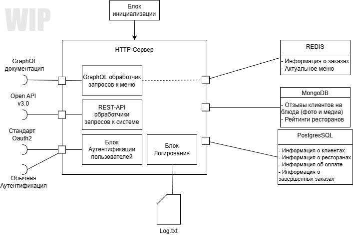

# Курсовой проект ВОБД

> [!NOTE]
> Это курсовой проект.
> Данный репозиторий создлан в рамках курса ВОБД (Веб-Ориентированные Базы Данных).
> Цель - разработка программного обеспечения в

ПГУТИ. 1-й курс направления ИСТ, профиль "Веб-инженерия" 
Преподователь: __Малахов С.В.__ 
Выполнил: __Додонов Н.А.__ 
Группа: __Ф1-ИСТ-51м__

## Вариант 1. "Система управления онлайн заказами"
__Назначение бд__

Хранение данных о ресторанах, меню, заказах, клиентах, оплатах и доставках.

__Особенности__
* [x] Авторизация через OAuth2
* [ ] JWT-токены для взаимодействия с API
* [ ] GraphQL запросы к меню и статусам заказов.
* [ ] Redis кэширует актуальное меню и статусы.
* [ ] MongoDB хранит отзывы и фото блюд.
* [ ] Транзакции при оплате и подтверждении заказов.
* [ ] Миграции с precondition при изменении схемы заказов.

## О приложении
Система управления онлайн заказами (далее система) - back-end программный продукт, 
позволяющий совершать заказы из нескольких ресторанов города с учётом имеющегося у 
них меню. Система позволяет создавать заказ, следить за процессом доставки, 
просматривать отзывы других клиентов на блюда ресторанов, оставлять самому отзывы.

Просмотр меню осуществляется через связку GraphQL, Redis и Postgres. Отзывы на блюда 
c их фото хранятся в MongoDB. Запись заказа в систему производится единой транзакцией:
"Проверка есть ли ресторан, есть ли блюдо, проверка оплаты, создание заказа, запись заказа
в историю пользователя, создание процедуры доставки". 

Аутентификация в систему доступна 2 способами: Oauth2 (Google, Yandex) и Обычная авторизация.
После проверки и аутентификации в системе пользователю возвращается JWT токен с информацией о нём:
Логин, ID в системе, время жизни токена.

## Диаграмма приложения

## Как запустить?

> [!warning]
> Данный раздел будет дополняться и изменяться с каждой номерной версией.
> Если у вас не работает - значит раздел не полный или информация устарела.

1. Установить переменные окружения:
     Config_Path - адресс до файла конфигурации
     Google_Client_ID - Открытый ключ Google приложения Oauth2. [Документация](https://developers.google.com/identity/protocols/oauth2?hl=ru)
     Google_Client_Secret - Приватный ключ Google приложения Oauth2.
     Yandex_Client_ID - Открытый ключ Yandex приложения Oauth2. [Документация](https://yandex.ru/dev/id/doc/ru/how-to)
     Yandex_Client_Secret - Приватный ключ Yandex приложения Oauth2.
2. Запустить приложение.

## Использованые библиотеки

* [Библиотека OAuth2 для Go](https://github.com/golang/oauth2)
* [Библиотека JWT для Go](https://github.com/golang-jwt/jwt)
* [Библиотека GraphQL для Go](https://github.com/graphql-go/graphql)
* [Драйвер подключения Redis для Go](https://github.com/redis/go-redis)
* [Драйвер подключения MongoDB для Go](https://github.com/mongodb/mongo-go-driver)
* [Расширение стандартного драйвера SQL для Go](https://github.com/jmoiron/sqlx)
* [Минималистичный читатель конфигурации](https://github.com/ilyakaznacheev/cleanenv)
* [Маршрутизатор chi](https://github.com/go-chi/chi)
* [Дополнение маршрутизатора chi для проверок CORS](https://github.com/go-chi/cors)

